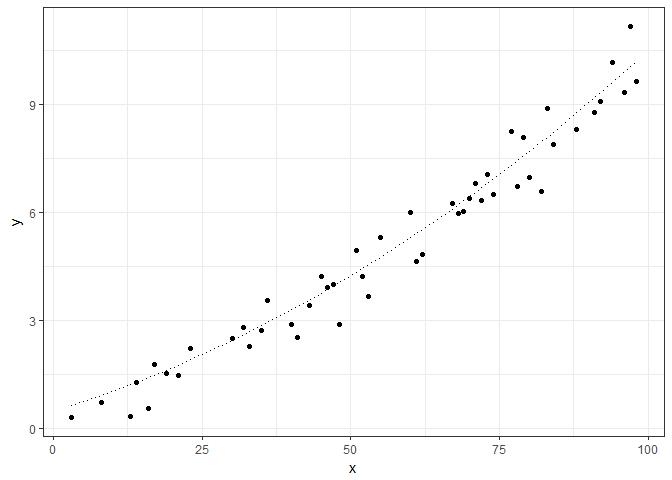
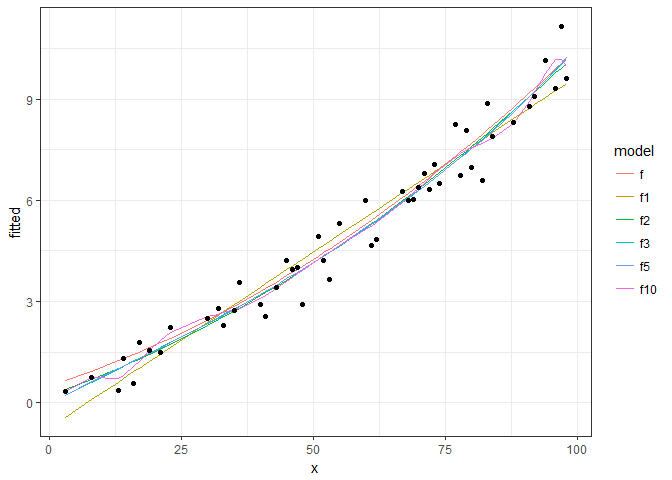
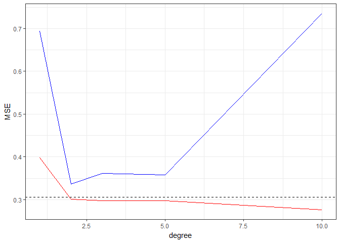
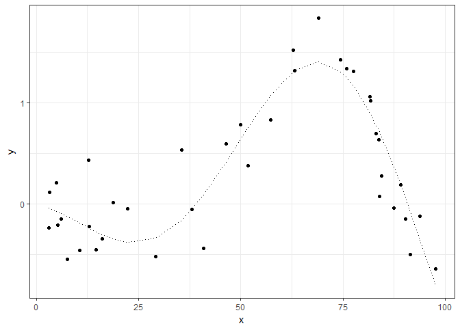
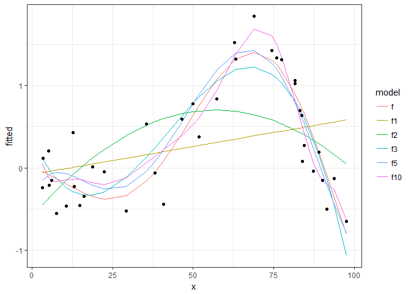
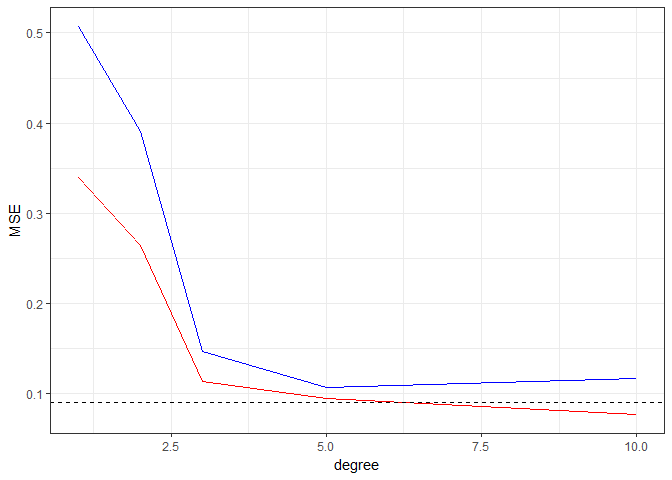

## Introduction

This article talks about the use of **Mean Squared Error (MSE)** against the flexibility of a function fited as a technique to assess the model accuracy in a specific problem as describe in the [An Introduction to Statistical Learning in R](https://www.amazon.com/Introduction-Statistical-Learning-Applications-Statistics/dp/1461471370) book.

## Measure the quality of fit (regression problems)

In order to evaluate the performance of a statistical learning method on a given data set, we need some way to measure how well its predictions actually match the observed data. That is, we need to quantify the extent to which the predicted response value for a given observation is close to the true response value for that observation. 

In the **regression setting**, the most commonly-used measure is the mean squared error (MSE), given by:

$$ MSE = \frac{1}{N}\sum_{i=1}^{n}(y_i-\hat{f}(x_i))^2 $$ 

Where $\hat{f}(x_i)$ is the predicted (or fitted) function at x~i~ and y~i~ is the real value.

So, the MSE is computed using the training data that was used to fit the model, and so should more accurately be referred to as the training MSE, but we want to evaluate the performance of the  $\hat{f}()$ against the unkwon data points, so we also compute MSE in an _test set_ with data points different from used to fit the $\hat{f}()$, now we have a MSE~tr~ for training points and a MSE~ts for test set.

We want to choose the method that gives the lowest test MSE, as opposed to the lowest training MSE (MSE~ts~).

## Comparing MSE~tr~ and MSE~ts~

Let's simulate some situations to see how MSE~tr~ and MSE~ts against diferent fitting techniques, we'll use polinomials fit to simplify the cenarios.

### Curve 1


```r
# setup
library(ggplot2)
library(tidyverse)
library(reshape2)
```


```r
DOMAIN <- 1:100

# function linear gausian noise sd=1
f <- function(x) 0.0005*x^2 + 0.05*x + 0.5
noise <- function(x) 0.5 * rnorm(x)

data_frame(
  x = DOMAIN,
  f = f(x)
) %>%
  # adding noise
  mutate(
    y = f + noise(DOMAIN)
  ) -> dt

# separing in training and testing
idx.tr <- sample(DOMAIN,round(length(DOMAIN)/2))
dt_tr <- dt[idx.tr,]
dt_ts <- dt[-idx.tr,]

#  visualizing training data
ggplot(dt_tr, aes(x=x)) +
  geom_point(aes(y=y)) +
  geom_line(aes(y=f), linetype="dotted") +
  theme_bw()
```

<!-- -->

Let's fit some cases in these datasets, we will use an linear regration, and some polinomial data.


```r
degrees <- c(1,2,3,5,10)

fitPoly <- function(degree,data){
  lm(y ~ poly(x, degree, raw=TRUE), data)
}

models <- map(degrees, fitPoly, data=dt_tr)

models %>%
  map(function(model){model$fitted.values}) %>%
  set_names(paste0("f",degrees)) %>%
  as_data_frame() %>%
  cbind(dt_tr, .) -> dt_tr_fit

dt_tr_long <- dt_tr_fit %>%
  melt(id.vars="x", variable.name="model", value.name = "fitted")

ggplot(dt_tr_long) +
  geom_line(data=dt_tr_long[dt_tr_long$model!="y",], aes(x=x, y=fitted, colour=model)) +
  geom_point(data=dt_tr_long[dt_tr_long$model=="y",], aes(x=x,y=fitted)) +
  theme_bw()
```

<!-- -->

We see in this chart, the real data points (points), the real function (continuous black line) and diferent fitting curves (colored lines) from 1 degree to 50 degree. Now let's see the performances of these models, calculating and ploting MSE on training and testing sets.


```r
# calc MSE from the residuals of the model
getMSE <- function(lm.model) sum(lm.model$residuals^2)/length(lm.model$residuals)

# calc MSE to the training set in a model
calcMSE <- function(lm.model, newdata){
  y_hat <- predict(lm.model, newdata=newdata)
  mse <- (1/length(y_hat))*sum( (newdata$y-y_hat)^2 )
  return(mse)
}

# performances
perf <- data_frame(
  degree = degrees,
  MSE.tr = unlist(map(models, getMSE)),
  MSE.ts = unlist(map(models, calcMSE, dt_ts))
)

MSE <- sum( (dt$y-dt$f)^2 ) / nrow(dt)

ggplot(perf,aes(x=degree)) +
  geom_line(aes(y=MSE.tr), colour="red") +
  geom_line(aes(y=MSE.ts), colour="blue") +
  geom_hline(yintercept = MSE, linetype="dashed") +
  ylab("MSE") +
  theme_bw()
```

<!-- -->

We can see the behavior of MSE data, in the training data (Red) the incresing of the flexibility of the fit (degree in this case) will cause a continuos decreasing in the MSE value, but in the MSE of the test data we have a initial decreasing until some minimal value (de optimal fit) and then a increasing, showing that model overfitting the training set.


### Courve 2

Another example.


```r
DOMAIN <- runif(100, 1, 100)

# function linear gausian noise sd=1
f <- function(x) (-sin( (2*pi/length(DOMAIN)) * (x+10) )) * 2*x/100 + 0.001 * x
noise <- function(x) 0.3*rnorm(x)

data_frame(
  x = DOMAIN,
  f = f(x)
) %>%
  # adding noise
  mutate(
    y = f + noise(DOMAIN)
  ) -> dt

# separing in training and testing
idx.tr <- sample(DOMAIN,round(length(DOMAIN)/2))
dt_tr <- dt[idx.tr,]
dt_ts <- dt[-idx.tr,]

#  visualizing training data
ggplot(dt_tr, aes(x=x)) +
  geom_point(aes(y=y)) +
  geom_line(aes(y=f), linetype="dotted") +
  theme_bw()
```

<!-- -->


```r
degrees <- c(1,2,3,5,10)

models <- map(degrees, fitPoly, data=dt_tr)

models %>%
  map(function(model){model$fitted.values}) %>%
  set_names(paste0("f",degrees)) %>%
  as_data_frame() %>%
  cbind(dt_tr, .) -> dt_tr_fit

dt_tr_long <- dt_tr_fit %>%
  melt(id.vars="x", variable.name="model", value.name = "fitted")

ggplot(dt_tr_long) +
  geom_line(data=dt_tr_long[dt_tr_long$model!="y",], aes(x=x, y=fitted, colour=model)) +
  geom_point(data=dt_tr_long[dt_tr_long$model=="y",], aes(x=x,y=fitted)) +
  theme_bw()
```

<!-- -->


```r
# performances
perf <- data_frame(
  degree = degrees,
  MSE.tr = unlist(map(models, getMSE)),
  MSE.ts = unlist(map(models, calcMSE, dt_ts))
)

MSE <- sum( (dt$y-dt$f)^2 ) / nrow(dt)

ggplot(perf,aes(x=degree)) +
  geom_line(aes(y=MSE.tr), colour="red") +
  geom_line(aes(y=MSE.ts), colour="blue") +
  geom_hline(yintercept = MSE, linetype="dashed") +
  ylab("MSE") +
  theme_bw()
```

<!-- -->

