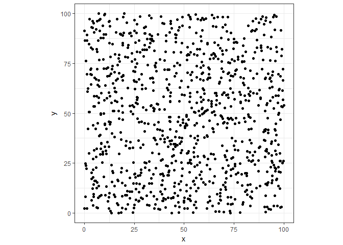
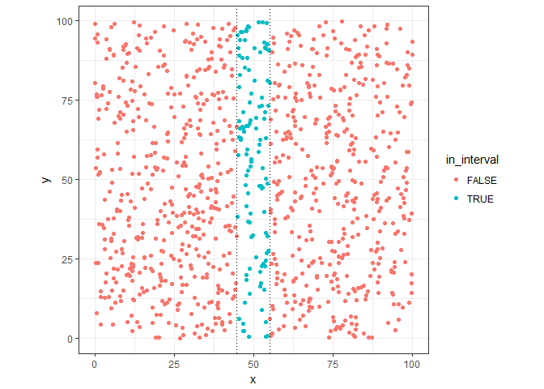
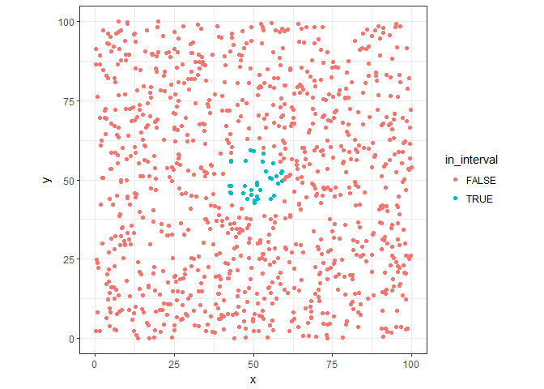
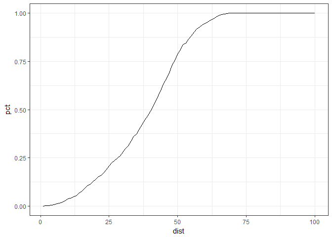
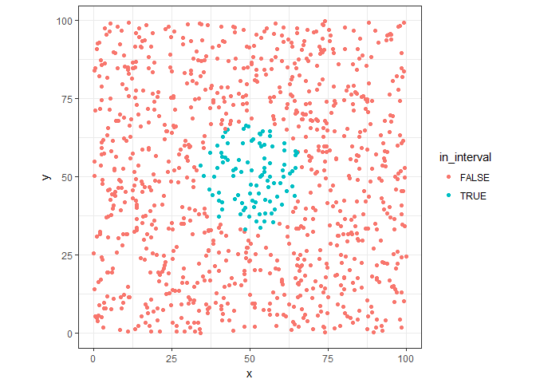
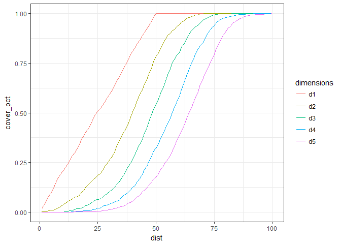

## Ond Dimension

This R Notebook reproduces the _Course of Dimensionality_ that is defined as the increasing of the interval size to get 10% of the data acording with the increasing of dimentions. So acording more dimentions are add to the domain, greater is the size of the range to get the same proportion of datapoints. Conforming we increase the size of the range we lost "locality" of the information, losing the capacity to resume the information with a simple average.

Let's see this in 1 and 2 dimensions.


```r
library(ggplot2)
library(tidyverse)
library(reshape2)
```


```r
# five dimentional datapoints
total_points <- 1000
dt <- data_frame(
  x = runif(total_points,0,100),
  y = runif(total_points,0,100),
  z = runif(total_points,0,100),
  w = runif(total_points,0,100),
  v = runif(total_points,0,100)
)

# let's see them
ggplot(dt, aes(x=x, y=y)) + geom_point() + coord_fixed(ratio = 1) + theme_bw()
```

<!-- -->

Let's supose that we need to get 10% of points around ```x=50``` (100 points), what is the size of interval necessary to get these points?


```r
x_dist <- quantile(x=dt$x,probs = .1)
x_dist
```

```
##      10% 
## 9.233336
```

We can see that in one dimention the size of the range necessary to get 10% of the datapoints are around 10% of this dimentions (uniform distributed)


```r
# mark the points in this range
dt %>%
  mutate(
    in_interval = case_when(
      x <= 50+(x_dist/2) & x >= 50-(x_dist/2) ~ TRUE,
      TRUE ~ FALSE
    )
  ) -> dt

# plot them
ggplot(dt, aes(x=x, y=y, colour=in_interval)) +
  geom_point() +
  geom_vline(xintercept = 50-(x_dist/2), linetype="dotted") +
  geom_vline(xintercept = 50+(x_dist/2), linetype="dotted") +
  coord_fixed(ratio = 1) + theme_bw()
```

<!-- -->

```r
# how much points?
dt %>%
  filter(in_interval==T) %>%
  nrow()
```

```
## [1] 94
```

## Two Dimension

Now, lets see the case in two dimentions, firts we'll use the same interval found in one dimention case: ``9.2333364``, but in this case, we need to check points around ```(x=50, y=50)```.


```r
dt %>%
  mutate(
    in_interval = case_when(
      sqrt((x-50)^2 + (y-50)^2) < x_dist ~ TRUE,
      TRUE ~ FALSE
    )
  ) -> dt
      

ggplot(dt, aes(x=x, y=y, colour=in_interval)) +
  geom_point() + coord_fixed(ratio = 1) + theme_bw()
```

<!-- -->

Now wee see that the number of point get in this range is significantly lower than previus case.


```r
# how much points?
dt %>%
  filter(in_interval==T) %>%
  nrow() -> sel_points

sel_points_pct <- sel_points/total_points

sel_points
```

```
## [1] 32
```

In fact, with the new distance, we can only reach 3.2 % of the datapoints adding one dimention. Can we find how much be the size of the radius to get 10% of the points?


```r
# percents 
dists <- 1:100

dists %>%
  map(function(dist){
    dt %>%
      filter(sqrt((x-50)^2 + (y-50)^2) < dist) %>%
      nrow() -> sel_points
    
    return(data_frame(
      dist = dist,
      points = sel_points,
      pct = sel_points/total_points
    ))
  }) %>% bind_rows() -> distCases

ggplot(distCases, aes(x=dist, y=pct)) +
  geom_line() + theme_bw()
```

<!-- -->

```r
distCases %>%
  filter( pct <= .1 ) %>%
  filter( pct == max(pct) ) -> twoDim10pct

twoDim10pct
```

<div data-pagedtable="false">
  <script data-pagedtable-source type="application/json">
{"columns":[{"label":["dist"],"name":[1],"type":["int"],"align":["right"]},{"label":["points"],"name":[2],"type":["int"],"align":["right"]},{"label":["pct"],"name":[3],"type":["dbl"],"align":["right"]}],"data":[{"1":"18","2":"99","3":"0.099"}],"options":{"columns":{"min":{},"max":[10]},"rows":{"min":[10],"max":[10]},"pages":{}}}
  </script>
</div>

The distance to get 10% of data points are 18 in size, almost twice the original range in one dimention.


```r
dt %>%
  mutate(
    in_interval = case_when(
      sqrt((x-50)^2 + (y-50)^2) < twoDim10pct$dist ~ TRUE,
      TRUE ~ FALSE
    )
  ) -> dt

ggplot(dt, aes(x=x, y=y, colour=in_interval)) +
  geom_point() + coord_fixed(ratio = 1) +
  theme_bw()
```

<!-- -->

## More dimentions

We can generalize and see the impact in the size of range along the adicional dimension?


```r
# percents 
dists <- 1:100

dists %>%
  map(function(dist){
        dt %>% 
          group_by() %>%
          summarise(
            d1 = sum( abs(50-x) <= dist ),
            d2 = sum( sqrt( (x-50)^2 + (y-50)^2) < dist ),
            d3 = sum( sqrt( (x-50)^2 + (y-50)^2 + (z-50)^2 ) < dist ),
            d4 = sum( sqrt( (x-50)^2 + (y-50)^2 + (z-50)^2 + (w-50)^2 ) < dist ),
            d5 = sum( sqrt( (x-50)^2 + (y-50)^2 + (z-50)^2 + (w-50)^2 + (v-50)^2 ) < dist )
          ) %>% mutate_all(function(x) x/total_points) %>% mutate( dist=dist )
    }) %>%
  bind_rows() %>% 
  melt(id.vars = c("dist")) %>%
  rename( 
    cover_pct = value,
    dimensions = variable
  ) %>%
  mutate( dimensions=as.factor(dimensions) ) -> multDimCases

multDimCases %>%
  ggplot(aes(x=dist, y=cover_pct, colour=dimensions)) +
  geom_line() + theme_bw() 
```

<!-- -->

