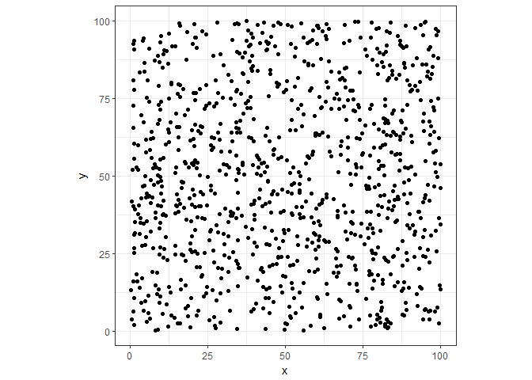
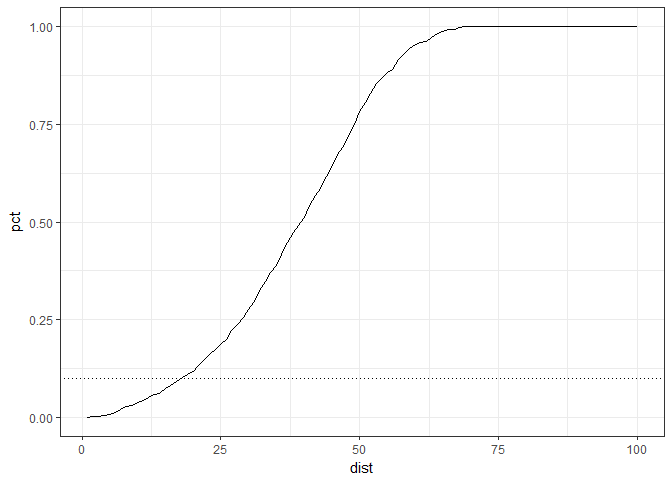
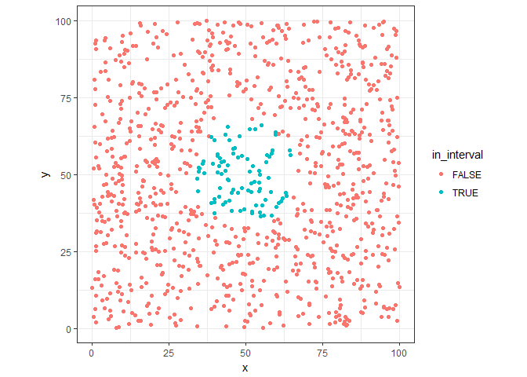

## Introduction

This R Notebook reproduces the **Curse of Dimensionality**[^1] in the _nearest neighbor regression_ that here is defined as *the increasing of the interval size* to get 10% of the data *acording with the increasing of dimentions*. So according more dimensions are add to the domain, greater is the size of the range to get the same proportion of data points. Conforming we increase the size of the range we lost "locality" of the information, losing the capacity to resume the information with a simple average.

## Nearest Neighbor Moving Average

In this article, the _curse of dimensionality_ comes from try to use of _Nearest Neighbor_ as predictors for a function. We iteratively select 10% of nearest points in the dataset at a specific point X~0~ and calculates the average of these points to use as the result of  prediction of a function in at the X~0~ point.

With lower dimensionality (around 4) and a great number of sample this is a great technique and easy to use, to compute and to interpret, but according the number of dimensions increase, we loose the locality of the information because to get 10% of the points we need do increase the interval arount the X~0~. Let's see this effect in a simulation data.

## Dataset

Let's build a 5 dimensional data set 


```r
library(ggplot2)
library(tidyverse)
library(reshape2)
```


```r
# five dimentional datapoints
total_points <- 1000
dt <- data_frame(
  x = runif(total_points,0,100),
  y = runif(total_points,0,100),
  z = runif(total_points,0,100),
  w = runif(total_points,0,100),
  v = runif(total_points,0,100)
)

# let's see them
ggplot(dt, aes(x=x, y=y)) + geom_point() + coord_fixed(ratio = 1) + theme_bw()
```

<!-- -->

Let's suppose that we need to get 10% of points around `x=50` (100 points), what is the size of interval necessary to get these points?


```r
x_dist <- quantile(x=dt$x,probs = .1)
x_dist
```

```
##     10% 
## 9.25175
```

We can see that in one dimension the size of the range necessary to get 10% of the data points are around 10% of this dimensions (uniform distributed)


```r
# mark the points in this range
dt %>%
  mutate(
    in_interval = case_when(
      x <= 50+(x_dist/2) & x >= 50-(x_dist/2) ~ TRUE,
      TRUE ~ FALSE
    )
  ) -> dt

# plot them
ggplot(dt, aes(x=x, y=y, colour=in_interval)) +
  geom_point() +
  geom_vline(xintercept = 50-(x_dist/2), linetype="dotted") +
  geom_vline(xintercept = 50+(x_dist/2), linetype="dotted") +
  coord_fixed(ratio = 1) + theme_bw()
```

<!-- -->

```r
# how much points?
dt %>%
  filter(in_interval==T) %>%
  nrow()
```

```
## [1] 87
```

## Two Dimension

Now, lets see the case in two dimensions, first we'll use the same interval found in one dimension case: 9.2517502, but in this case, we need to check points around `(x=50, y=50)`.


```r
dt %>%
  mutate(
    in_interval = case_when(
      sqrt((x-50)^2 + (y-50)^2) < x_dist ~ TRUE,
      TRUE ~ FALSE
    )
  ) -> dt
      

ggplot(dt, aes(x=x, y=y, colour=in_interval)) +
  geom_point() + coord_fixed(ratio = 1) + theme_bw()
```

<!-- -->

Now wee see that the number of point get in this range is significantly lower than previous case.


```r
# how much points?
dt %>%
  filter(in_interval==T) %>%
  nrow() -> sel_points

sel_points_pct <- sel_points/total_points

sel_points
```

```
## [1] 31
```

In fact, with the new distance, we can only reach 3.1 % of the data points adding one dimension. Can we find how much be the size of the radius to get 10% of the points?


```r
# percents 
dists <- 1:100

dists %>%
  map(function(dist){
    dt %>%
      filter(sqrt((x-50)^2 + (y-50)^2) < dist) %>%
      nrow() -> sel_points
    
    return(data_frame(
      dist = dist,
      points = sel_points,
      pct = sel_points/total_points
    ))
  }) %>% bind_rows() -> distCases

ggplot(distCases, aes(x=dist, y=pct)) +
  geom_line() +
  geom_hline(yintercept = 0.1, linetype="dotted") + 
  theme_bw()
```

<!-- -->

```r
distCases %>%
  filter( pct <= .1 ) %>%
  filter( pct == max(pct) ) -> twoDim10pct

print(twoDim10pct)
```

```
## # A tibble: 1 x 3
##    dist points    pct
##   <int>  <int>  <dbl>
## 1    17     91 0.0910
```

The distance to get 10% of data points are 17 in size, about twice the original range in one dimension.


```r
dt %>%
  mutate(
    in_interval = case_when(
      sqrt((x-50)^2 + (y-50)^2) < twoDim10pct$dist ~ TRUE,
      TRUE ~ FALSE
    )
  ) -> dt

ggplot(dt, aes(x=x, y=y, colour=in_interval)) +
  geom_point() + coord_fixed(ratio = 1) +
  theme_bw()
```

<!-- -->

## More dimentions

We can generalize and see the impact in the size of range along the additional dimension?


```r
# percents 
dists <- 1:100

dists %>%
  map(function(dist){
        dt %>% 
          group_by() %>%
          summarise(
            d1 = sum( abs(50-x) <= dist ),
            d2 = sum( sqrt( (x-50)^2 + (y-50)^2) < dist ),
            d3 = sum( sqrt( (x-50)^2 + (y-50)^2 + (z-50)^2 ) < dist ),
            d4 = sum( sqrt( (x-50)^2 + (y-50)^2 + (z-50)^2 + (w-50)^2 ) < dist ),
            d5 = sum( sqrt( (x-50)^2 + (y-50)^2 + (z-50)^2 + (w-50)^2 + (v-50)^2 ) < dist )
          ) %>% mutate_all(function(x) x/total_points) %>% mutate( dist=dist )
    }) %>%
  bind_rows() %>% 
  melt(id.vars = c("dist")) %>%
  rename( 
    cover_pct = value,
    dimensions = variable
  ) %>%
  mutate( dimensions=as.factor(dimensions) ) -> multDimCases

multDimCases %>%
  ggplot(aes(x=dist, y=cover_pct, colour=dimensions)) +
  geom_line() +
  geom_hline(yintercept = 0.1, linetype="dotted") + 
  theme_bw() 
```

<!-- -->

The distances to capture 10% of data points along the 5 dimension.


```r
multDimCases %>% 
  group_by(dimensions) %>%
  filter( cover_pct <= 0.1 ) %>%
  filter( cover_pct == max(cover_pct) ) %>%
  select( dimensions, dist ) %>% print()
```

```
## # A tibble: 5 x 2
## # Groups: dimensions [5]
##   dimensions  dist
##   <fctr>     <int>
## 1 d1             5
## 2 d2            17
## 3 d3            29
## 4 d4            37
## 5 d5            45
```

## Conclusion

We can see cleary how the effect of the increase of the data dimensionality afects the size of interval, at 5-dimensions is necessary that half of total lenght of data points to get 10% of the data set, destroying the "locality" information. 

[^1]: https://en.wikipedia.org/wiki/Curse_of_dimensionality
