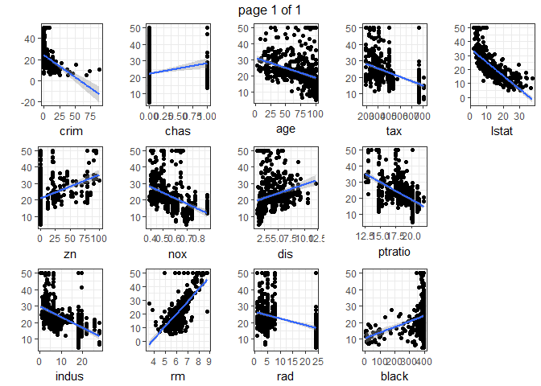

In this [R Notebook](http://rmarkdown.rstudio.com/r_notebooks.html) we will test exercise and eval some model selection strategies involving linear regration.

## Data set

We will use Boston dataset in the [MASS package](https://cran.r-project.org/web/packages/MASS/MASS.pdf) with the housing values in suburbs of Boston, the dataframe has 506 rows and 14 columns.


```r
# basic library
library(MASS)
library(tidyverse)
library(ggplot2)
library(grid)
library(gridExtra)

# dataset
bd <- Boston
str(bd)
```

```
## 'data.frame':	506 obs. of  14 variables:
##  $ crim   : num  0.00632 0.02731 0.02729 0.03237 0.06905 ...
##  $ zn     : num  18 0 0 0 0 0 12.5 12.5 12.5 12.5 ...
##  $ indus  : num  2.31 7.07 7.07 2.18 2.18 2.18 7.87 7.87 7.87 7.87 ...
##  $ chas   : int  0 0 0 0 0 0 0 0 0 0 ...
##  $ nox    : num  0.538 0.469 0.469 0.458 0.458 0.458 0.524 0.524 0.524 0.524 ...
##  $ rm     : num  6.58 6.42 7.18 7 7.15 ...
##  $ age    : num  65.2 78.9 61.1 45.8 54.2 58.7 66.6 96.1 100 85.9 ...
##  $ dis    : num  4.09 4.97 4.97 6.06 6.06 ...
##  $ rad    : int  1 2 2 3 3 3 5 5 5 5 ...
##  $ tax    : num  296 242 242 222 222 222 311 311 311 311 ...
##  $ ptratio: num  15.3 17.8 17.8 18.7 18.7 18.7 15.2 15.2 15.2 15.2 ...
##  $ black  : num  397 397 393 395 397 ...
##  $ lstat  : num  4.98 9.14 4.03 2.94 5.33 ...
##  $ medv   : num  24 21.6 34.7 33.4 36.2 28.7 22.9 27.1 16.5 18.9 ...
```

We'll try to stablish a model for variable `medv` (median value of owner-occupied homes in \$1000), using a linear/polynomial model of other variables. In this case, the number of variables is low (13) so it's possible see an overview of the relationship between them and the `medv`.


```r
# what are the predictors?
features <- names(bd)
features <- features[features!="medv"] # removing target (y)

map(features,function(feat,data=bd){
  ggplot(data, aes_string(x=feat, y="medv")) +
    geom_point() + theme_bw() + stat_smooth(method="lm") +  ylab("")
}) -> featPlots

marrangeGrob(featPlots, nrow=3, ncol=5)
```

<!-- -->

